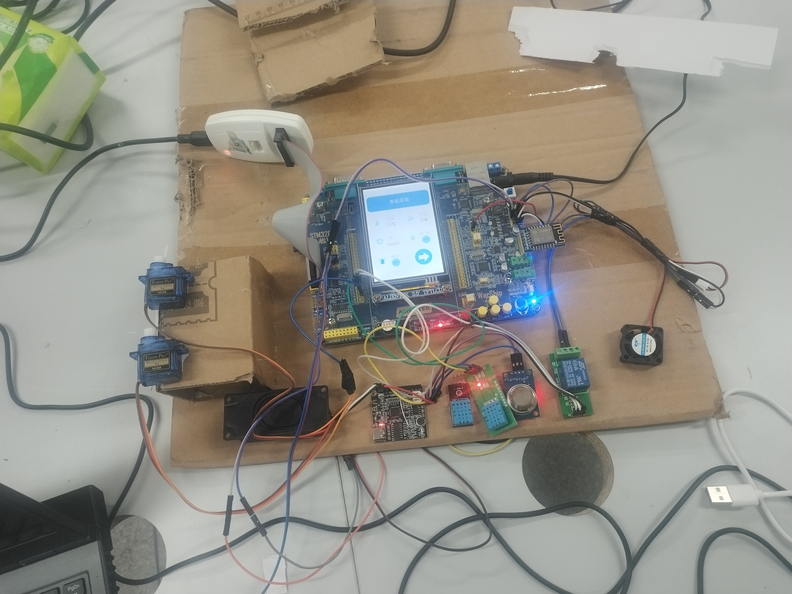

# 单片机学习记录

## C51

> keil5 + vscode
> 使用 C 语言和汇编语言实现

> [笔记](./C51/C51.md)

### 程序

#### 汇编程序

- [LED](./C51/LED/asm/LED.uvproj)
- [LCD12864 播放视频(串口通信)](./C51/PICTURE/asm/PICTURE.uvproj)

#### C 程序

##### I/O

- [LED](./C51/LED/)
- [ADC](./C51/ADC/)
##### 中断

- [外部中断](./C51/Interrupt/External_Interrupt/Exterinal_Interrupt.uvproj)
- [定时器中断](./C51/Interrupt/Timer_Interrupt/Timer_Interrput.uvproj)
- [串口中断](./C51/Interrupt/Serial_Interrupt/Serial.uvproj)

##### 通信协议

- [IIC*MPU6050*陀螺仪](./C51/Serial/I2C/MPU6050/MPU6050.uvproj)
- [单总线协议\_DS18B20](./C51/Serial/OneWire/DS18B20/DS18B20.uvproj)
- [LCD12864 播放视频(串口通信)](./C51/PICTURE/c/badapple.uvproj)
## STM32

> keil5 + vscode
> 使用 C 语言实现

### 笔记

> [笔记](./STM32/stm32.md)

### 程序

- [LED](./STM32/LED/led.uvopjx)
- [OLED](./STM32/OLED/OLED.uvprojx)
- [smart_house](./STM32/smart_house/MCUCode/USER/智能家居.uvprojx)
- 
## ESP8266

> arduino + vscode C/C++语言实现

### 笔记

> [笔记](./ESP8266/ESP8266.md)

### 程序

- [LED](./ESP8266/LED/LED.ino)
- [HelloWorld](./ESP8266/HelloWorld/HelloWorld.ino)
- [BasicConnect](./ESP8266/BasicConnect/BasicConnect.ino)
- [WebClient1](./ESP8266/WebClient/WebClient1/WebClient1.ino)
- [WebClient2](./ESP8266/WebClient/WebClient2/WebClient2.ino)

## Raspberry Pi Pico

> Thonny python

### 笔记

> [笔记](./raspberry%20pi%20pico/raspberry%20pico.md)

### 程序

[LED](./raspberry%20pi%20pico/LED/main.py)
